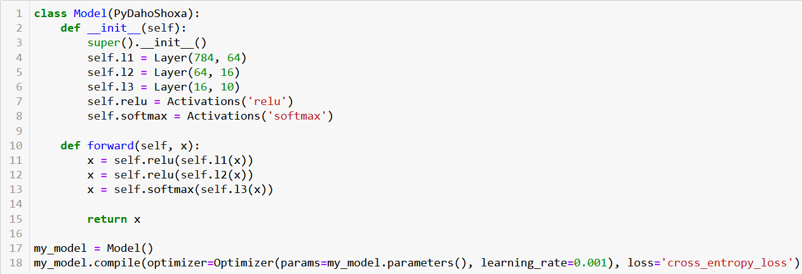
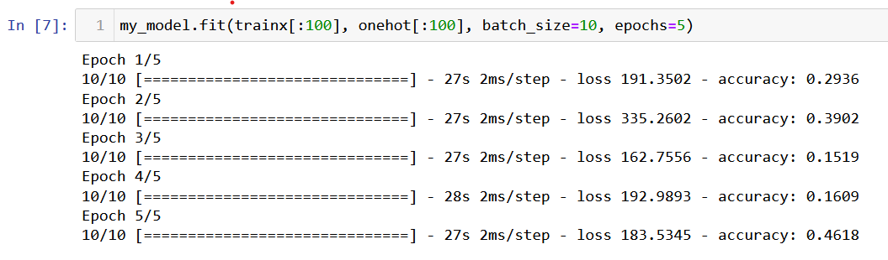

English | [O'zbekcha](READMEuz.md)

# New framework from Daholar

This framework only supports model building through ANN layers

### Sample usage of framework

In this case, the [mnist](https://www.google.com/url?sa=t&rct=j&q=&esrc=s&source=web&cd=&cad=rja&uact=8&ved=2ahUKEwjfw7WU3eL9AhXSi8MKHdt3DakQFnoECA4QAQ&url=http%3A%2F%2Fyann.lecun.com%2Fexdb%2Fmnist%2F&usg=AOvVaw2l4Jn0H3ZvSJ336fACilwX) dataset was trained by ANN. The code is as follows:

```
python3 UsageOfFramework.py
```

If you need to another architecture of model you need to has change code like [Pytorch](https://github.com/pytorch/pytorch.git).<br>
The code is as follows:

<a></a>

In our framework training process goes like [Tensorflow](https://github.com/tensorflow/tensorflow.git).

<a></a>

## Features

### Forward propagation

- This technology helps us make predictions by model.

### Backpropagation

- This technology allows us to adjust the parameters of our model through a chain rule.

## Installation
Install python and:
```
pip install -r requirements.txt
```
