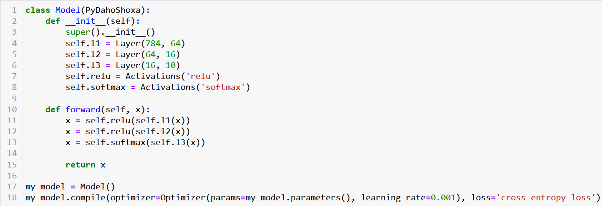
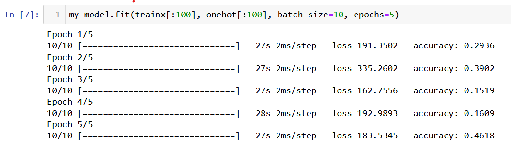

[English](README.md) | O'zbekcha

# Daholardan yangi framework

Bu framework faqat ANN layerlari orqali model qurishni qo'llab quvvatlaydi.

### Frameworkdan foydalanish namunasi

Bunda [mnist](https://www.google.com/url?sa=t&rct=j&q=&esrc=s&source=web&cd=&cad=rja&uact=8&ved=2ahUKEwjfw7WU3eL9AhXSi8MKHdt3DakQFnoECA4QAQ&url=http%3A%2F%2Fyann.lecun.com%2Fexdb%2Fmnist%2F&usg=AOvVaw2l4Jn0H3ZvSJ336fACilwX) dataseti ANN orqali o'qitilgan. Kod quyidagicha:

```
python3 UsageOfFramework.py
```

Agar siz boshqacha arxitektura qurmoqchi bo'lsangiz, xuddi [Pytorch](https://github.com/pytorch/pytorch.git) kabi arxitektura tuzishingiz mumkin.<br>
Namunaviy kod quyidagicha:

<a></a>

Frameworkda training jarayoni xuddi [Tensorflow](https://github.com/tensorflow/tensorflow.git) kabi ishlaydi.

<a></a>

## Xususiyatlar

### Forward propagation

- Bu texnologiya bizga model tomonidan bashorat amalga oshirishga yordam beradi

### Backpropagation

- Bu texnologiya bizga model parameterlarini zanjir qoidasi orqali optimallashtirish imkonini beradi

## O'rnatish
Python dasturlash tilini o'rnating va:
```
pip install -r requirements.txt
```
